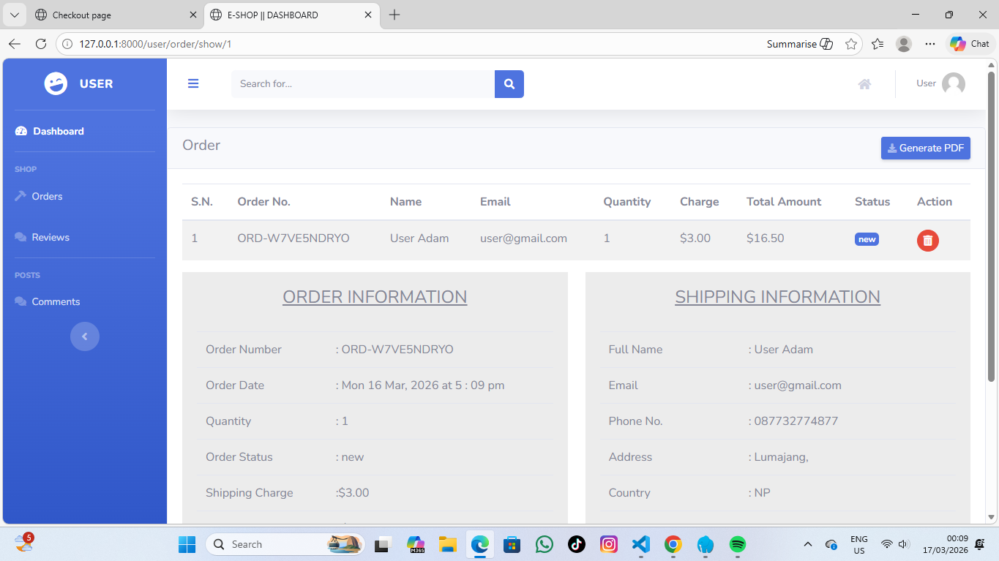
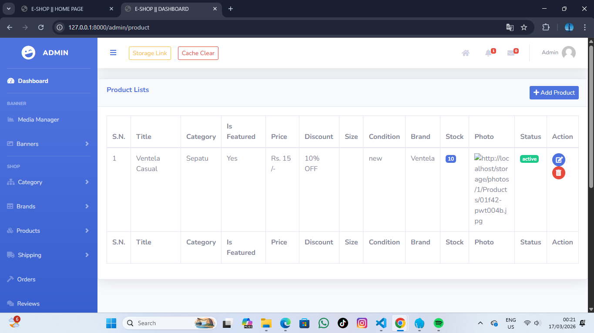
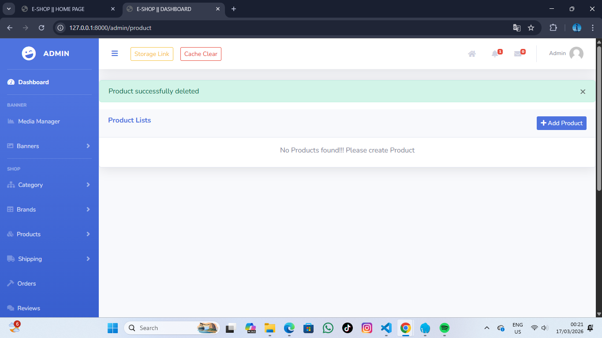
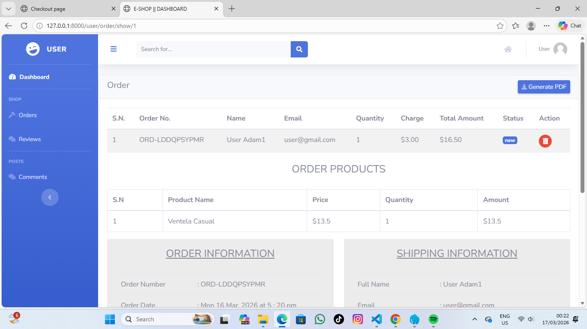

[](https://github.com/Prajwal100)
[](https://github.com/Prajwal100/Complete-Ecommerce-in-laravel-10/stargazers)
[](https://github.com/Prajwal100/Complete-Ecommerce-in-laravel-10/network)
[](https://choosealicense.com/licenses/mit/)
[](https://buymeacoffee.com/prajwalrai/support-my-work-complete-laravel-e-commerce-project)

# 🚀 Complete E-commerce Website in Laravel 10

A full-fledged **eCommerce solution** built on **Laravel 10**, featuring a modern UI, powerful admin panel, seamless payment integration, and a user-friendly shopping experience.

## 📋 Requirements

- PHP >= 8.1
- Composer
- Node.js & NPM
- MySQL/PostgreSQL
- Laravel 10.x

## 🌟 Features

### 🔹 **Frontend**

- ⚡ **Progressive Web App (PWA) support**
- 🎨 **Modern & responsive design**
- 🛒 **Shopping cart, wishlist, and order tracking**
- 🔎 **SEO-friendly URLs & metadata**
- 💳 **Integrated PayPal payment gateway**
- 📢 **Social login (Google, Facebook, Github)**
- 💬 **Multi-level comments & reviews**

### 🔹 **Admin Dashboard**

- 🎛️ **Role management**
- 📊 **Advanced analytics & reporting**
- 🛍️ **Product & order management**
- 🔔 **Real-time notifications & messaging**
- 🏷️ **Coupon & discount system**
- 📰 **Blog & category management**
- 📸 **Media & banner manager**

### 🔹 **User Dashboard**

- 📦 **Order history & tracking**
- 💬 **Review & comment system**
- 🔧 **Profile customization**

---

## 🛠️ Installation Guide

### 🔹 **Step 1: Clone the Repository**

```sh
git clone https://github.com/Prajwal100/Complete-Ecommerce-in-laravel-10.git
cd Complete-Ecommerce-in-laravel-10
```

### 🔹 **Step 2: Install Dependencies**

```sh
composer install
npm install
```

### 🔹 **Step 3: Environment Setup**

```sh
cp .env.example .env
php artisan key:generate
```

Update `.env` with your database credentials, PayPal settings, and social login configurations.

### 🔹 **Step 4: Database Configuration**

```sh
php artisan migrate --seed
```

**Note:** The seeder will create the admin user. Alternatively, you can import `database/e-shop.sql` manually.

### 🔹 **Step 5: Setup Storage**

```sh
php artisan storage:link
```

### 🔹 **Step 6: Run the Application**

```sh
php artisan serve
```

🔗 Open `http://localhost:8000`

### **Admin Login Credentials:**

📧 **Email:** `admin@gmail.com`  
🔑 **Password:** `1111`

---

## 🤖 Powered by NepVox AI - Complete AI Solution

🚀 **[NepVox AI](https://nepvox.com/)** is a cutting-edge **online AI application** that provides three powerful AI capabilities in one platform:

### 🎙️ **Text-to-Speech (TTS)**
- Convert any text into natural, human-like voice
- Multiple languages and voice options
- Perfect for videos, accessibility, podcasts, and e-learning

### 🗣️ **Speech-to-Text (STT)**
- Transcribe audio and speech to text with high accuracy
- Real-time transcription support
- Ideal for meetings, interviews, and voice notes

### 🎨 **Text-to-Image (TTI)**
- Generate stunning images from text descriptions
- AI-powered image creation
- Creative design and content generation

### ✨ **Key Features:**
- ✅ **All-in-One Platform**: TTS, STT, and TTI in a single application
- ✅ **Multiple Languages**: Support for various languages and voices
- ✅ **API Integration**: Simple API for seamless business integration
- ✅ **High Quality**: Professional-grade AI technology
- ✅ **User-Friendly**: Intuitive interface for all skill levels

🎯 **Perfect for:** Content creators, developers, businesses, educators, and anyone looking to leverage AI technology.

🔗 **Try it now:** [Visit NepVox AI](https://nepvox.com/) | [Documentation](https://nepvox.com/)

---

## 📷 Screenshots

### **Admin Panel**


### **Product Management**


### **User Dashboard**


---

## 📩 Contact Me

💼 Need a **Full Stack Laravel Developer**? Let's work together!

📧 **Email:** Prajwal.iar@gmail.com
📲 **WhatsApp:** +977-9818441226

🔗 **[Hire Me on Upwork](https://www.upwork.com/freelancers/~01210bb2575a8c05a9)**

### ☕ Support My Work

If you find this project helpful, consider [buying me a coffee](https://buymeacoffee.com/prajwalrai/support-my-work-complete-laravel-e-commerce-project). Your support helps maintain and improve this project! 🚀

---

## 🤝 Contributing

Contributions are welcome! Please feel free to submit a Pull Request.

1. Fork the repository
2. Create your feature branch (`git checkout -b feature/AmazingFeature`)
3. Commit your changes (`git commit -m 'Add some AmazingFeature'`)
4. Push to the branch (`git push origin feature/AmazingFeature`)
5. Open a Pull Request

---

## 📜 License

🔹 This project is **MIT Licensed** – Feel free to use & modify!

⭐ **If you find this project helpful, don't forget to star it!** ⭐

---

# Take-Home Test Implementation

This section describes the changes implemented to complete the take-home test tasks.

## Task 1 – Add Order Product List on Order Detail Page

The order detail page:

```
/user/order/show/{order_id}
```

was updated to display the list of purchased products.

Each order loads its cart items using the `cart_info` relationship:

```
Order::with(['cart_info.product','user','shipping'])->findOrFail($id);
```

The order detail view now renders a table containing:

* Product name
* Price
* Quantity
* Amount

This allows users to see the exact products included in the order.

---

## Task 2 – Prevent Order Changes When Product Is Updated or Deleted

To ensure historical order data remains unchanged when a product is edited or deleted, a **snapshot of the product title** is stored during checkout.

The `carts` table already includes the column:

```
product_title
```

During checkout, the product title is saved:

```
$cart->product_title = $cart->product->title;
```

The order detail page now displays the stored `product_title` instead of retrieving it dynamically from the `products` table.

This ensures that:

* Updating a product name does not affect existing orders
* Deleting a product does not break the order detail page

---

# Suggestions / Improvements

1. **Use Order Items Table**

Instead of using the `carts` table for completed orders, it would be better to create a dedicated `order_items` table.

2. **Use Database Transactions**

The checkout process should use database transactions to prevent inconsistent data if an error occurs.

3. **Store Full Product Snapshot**

Additional product information should be stored when checkout occurs:

* product_name
* product_price
* product_image

This ensures order history remains accurate even if product data changes.

4. **Controller Refactoring**

Some controllers contain a large amount of logic and could be refactored into service classes.

---

# Proof

### Before Product Update

Order detail page showing the purchased product.

### After Product Update

The admin updates the product name in the product management page.
However, the order detail page still shows the original product name stored during checkout.

Screenshots:

| Before Product Update | After Product Update |
|----------------------|----------------------|
|  |  |
|  |  |
|  |  |

---